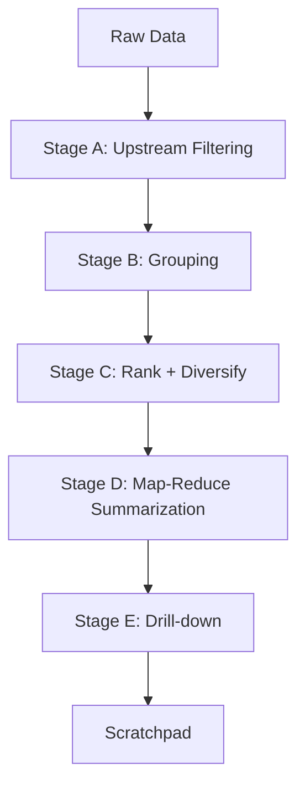

# Progressive Reduction Strategy

## Overview

The Progressive Reduction Pipeline is a sophisticated multi-stage approach to efficiently process and reduce large volumes of Slack data into token-efficient, structured formats suitable for LLM consumption.



## Stage A: Upstream Filtering

### Purpose
Filter data before it reaches the LLM to reduce token usage and improve relevance.

### Implementation
1. **Query Parameters**
   - Time window filtering
   - Channel/project filtering
   - Author filtering
   - Label/status filtering

2. **Pagination Controls**
   ```python
   {
     "page_size": 50,  # Default items per page
     "max_preview_length": 200,  # Characters per preview
     "return_facets": true  # Always return facets
   }
   ```

3. **Facet Structure**
   ```python
   {
     "channels": [{"name": "#eng", "count": 181}],
     "dates": [{"day": "2024-03-20", "count": 96}],
     "authors": [{"id": "U123", "count": 45}]
   }
   ```

## Stage B: Grouping

### Purpose
Organize data into meaningful clusters to provide structure and context.

### Implementation
1. **Slack Grouping**
   - Primary key: thread_id
   - One cluster per conversation
   - Preserve thread hierarchy

2. **Cluster Features**
   ```python
   {
     "cluster_id": "thread_123",
     "size": 15,  # Messages in thread
     "time_span": {
       "start": "2024-03-20T10:00:00Z",
       "end": "2024-03-20T15:30:00Z"
     },
     "engagement": {
       "replies": 12,
       "reactions": 25,
       "participants": 5
     }
   }
   ```

## Stage C: Rank + Diversify

### Purpose
Ensure result quality and diversity using reproducible scoring.

### Scoring Formula
```python
def score_item(item):
    return (
        0.35 * normalize(item.recency) +
        0.25 * normalize(item.engagement) +
        0.20 * normalize(item.authority) +
        0.20 * normalize(item.query_match)
    )
```

### MMR Implementation
```python
def select_diverse_items(items, k=5, lambda_param=0.7):
    selected = [max(items, key=score_item)]
    while len(selected) < k:
        next_item = max(
            remaining_items,
            key=lambda x: (
                lambda_param * score_item(x) -
                (1 - lambda_param) * max(similarity(x, s) for s in selected)
            )
        )
        selected.append(next_item)
    return selected
```

## Stage D: Map-Reduce Summarization

### Purpose
Create bounded-token summaries at multiple levels.

### Implementation
1. **Map Phase (Per Cluster)**
   - Input: Top 5-10 items per cluster
   - Output: 150-200 token summary
   - Include citation IDs

2. **Reduce Phase (Global)**
   - Input: Cluster summaries
   - Output: 300-400 token global summary
   - Maintain "Top 10 evidence" list

### Token Bounds
```python
BOUNDS = {
    "cluster_summary": 200,
    "global_summary": 400,
    "evidence_list": 10,
    "total_tokens": 800
}
```

## Stage E: Drill-down

### Purpose
Enable targeted exploration of specific items.

### Implementation
```python
async def fetch_evidence(ids: List[str]) -> Dict[str, Any]:
    """
    Fetch specific items by ID
    - Only fetch referenced items
    - Return structured content
    - Ready for scratchpad integration
    """
    pass
```

## Future Integration: Scratchpad

### Purpose
Maintain context and findings throughout the reduction process.

### Planned Structure
```python
{
    "context": {
        "query": str,
        "filters": Dict[str, Any],
        "strategy": str
    },
    "findings": [
        {
            "id": str,
            "summary": str,
            "evidence": List[str],
            "timestamp": str
        }
    ],
    "evidence_cache": {
        "id": {
            "content": str,
            "metadata": Dict[str, Any],
            "fetch_time": str
        }
    }
}
```

## Implementation Phases

1. **Phase 1: Core Pipeline**
   - Implement Stages A-C
   - Basic result reduction
   - Scoring and ranking

2. **Phase 2: Advanced Features**
   - Map-Reduce summarization
   - Drill-down capabilities
   - Enhanced grouping

3. **Phase 3: Optimization**
   - Performance tuning
   - Token optimization
   - Cache management

4. **Phase 4: Scratchpad Integration**
   - Implement scratchpad
   - Evidence management
   - Context preservation
