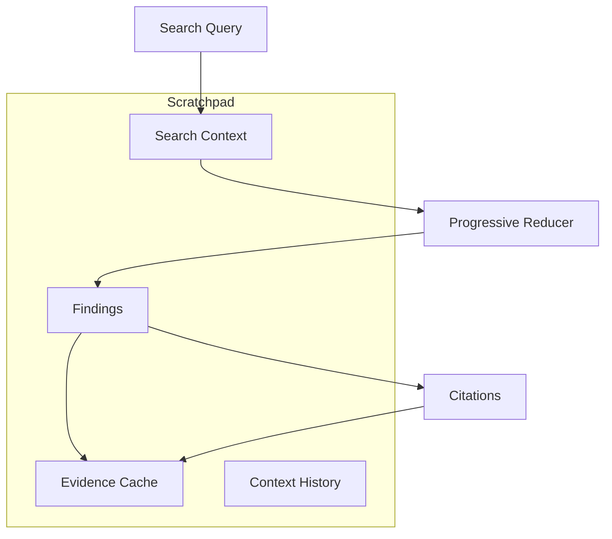

# Scratchpad for Progressive Reduction

## Overview

The Scratchpad is a crucial component in the progressive reduction pipeline, maintaining context and findings throughout the search and discovery process.



## Core Components

### 1. Search Context

Tracks the current search operation:

```python
@dataclass
class SearchContext:
    query: str
    filters: Dict[str, Any]
    strategy: str
    timestamp: str
```

### 2. Findings

Structured discoveries with evidence:

```python
@dataclass
class Finding:
    id: str
    summary: str
    evidence_ids: List[str]
    timestamp: str
    source: str
```

### 3. Evidence Cache

Cached content with TTL:

```python
@dataclass
class Evidence:
    content: str
    metadata: Dict[str, Any]
    fetch_time: str
    ttl: int  # seconds
```

## Usage Patterns

### 1. Basic Search Flow

```python
# 1. Start search
await scratchpad.add_context(
    query="api performance issues",
    filters={"time_range": {"start": "2024-01-01"}}
)

# 2. Add finding
finding_id = await scratchpad.add_finding(
    summary="API latency increased after deployment",
    evidence_ids=["msg_123", "msg_456"]
)

# 3. Cache evidence
await scratchpad.cache_evidence(
    "msg_123",
    content="Latency spike observed...",
    metadata={"channel": "#eng", "author": "alice"}
)
```

### 2. Evidence Retrieval

```python
# Get evidence for finding
evidence = await scratchpad.get_evidence("msg_123")

# Get findings citing evidence
findings = await scratchpad.get_findings_for_evidence("msg_123")
```

### 3. Context-Aware Search

```python
# Get findings relevant to context
findings = await scratchpad.get_context_findings(
    query="latency",
    source="slack"
)

# Summarize findings
summary = await scratchpad.summarize_findings(
    max_findings=5,
    query="performance"
)
```

## Integration with Progressive Reducer

The Scratchpad enhances the progressive reduction pipeline:

1. **Stage A (Filtering)**
   - Stores search context
   - Tracks applied filters
   - Maintains search history

2. **Stage B (Grouping)**
   - Caches cluster information
   - Links related findings
   - Tracks thread relationships

3. **Stage C (Ranking)**
   - Uses finding history for ranking
   - Considers evidence importance
   - Tracks citation patterns

4. **Stage D (Summarization)**
   - Stores computed summaries
   - Links to supporting evidence
   - Maintains citation graph

5. **Stage E (Drill-down)**
   - Caches fetched content
   - Tracks exploration paths
   - Manages evidence TTL

## Best Practices

### 1. Context Management

- Keep recent search context (last 10)
- Link related searches
- Track strategy changes

### 2. Finding Organization

- Limit total findings (default: 100)
- Include clear evidence links
- Add meaningful summaries

### 3. Evidence Caching

- Set appropriate TTLs
- Limit cache size (default: 1000)
- Include rich metadata

### 4. Performance Considerations

- Cache frequently accessed evidence
- Prune old findings regularly
- Maintain reasonable limits

## Example: Progressive Discovery

```python
class ProgressiveDiscovery:
    def __init__(self):
        self.scratchpad = Scratchpad()
        self.reducer = ProgressiveReducer()
        
    async def discover(self, query: str):
        # 1. Add search context
        await self.scratchpad.add_context(query)
        
        # 2. Get initial results
        results = await self.reducer.reduce_results(
            results=raw_results,
            query=query
        )
        
        # 3. Add findings
        for cluster in results["clusters"].values():
            finding_id = await self.scratchpad.add_finding(
                summary=cluster["features"].preview,
                evidence_ids=[item["id"] for item in cluster["items"]]
            )
            
        # 4. Cache evidence
        for item in results["items"]:
            await self.scratchpad.cache_evidence(
                item["id"],
                content=item["text"],
                metadata=item["metadata"]
            )
            
        # 5. Get context-aware summary
        return await self.scratchpad.summarize_findings(
            query=query
        )
```

## Future Enhancements

1. **Advanced Context Tracking**
   - Search path analysis
   - Intent recognition
   - Strategy optimization

2. **Smart Caching**
   - Predictive caching
   - Priority-based eviction
   - Cross-reference tracking

3. **Enhanced Finding Management**
   - Hierarchical findings
   - Automatic clustering
   - Relevance scoring

4. **Integration Points**
   - LLM-based summarization
   - Cross-source evidence
   - Collaborative findings
