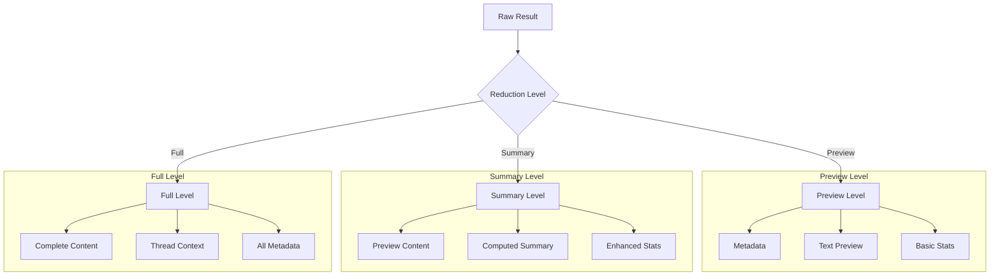

# Slack Result Reducer

## Reduction Levels



## Overview

The `SlackResultReducer` implements a progressive reduction pipeline for Slack search results. It transforms raw search results into structured, token-efficient formats suitable for LLM consumption.

## Core Concepts

### 1. Progressive Reduction

Results are reduced through multiple stages:

```
Raw Results → Metadata Extraction → Facet Computation → Preview Generation → (Optional) Summary/Full Content
```

### 2. Reduction Levels

Three levels of detail are supported:

1. **Preview** (`reduction_level="preview"`)
   ```python
   {
       "id": "slack:ch/eng/170921",
       "thread_id": "slack:th/170900",
       "ts": "2025-08-11T14:22:10Z",
       "author": "u123",
       "text_preview": "upgrading worker pool doubled latency...",
       "reactions": 7,
       "attachments": 1
   }
   ```

2. **Summary** (`reduction_level="summary"`)
   ```python
   {
       # Everything in preview, plus:
       "summary": "Discussion about API performance | 7 reactions | 1 attachment | Part of thread"
   }
   ```

3. **Full** (`reduction_level="full"`)
   ```python
   {
       # Everything in preview, plus:
       "text": "Full message content...",
       "reactions_detail": [...],
       "files": [...]
   }
   ```

### 3. Facet Computation

Automatic facet generation for:

- **Channels**: Distribution across channels
  ```python
  {"name": "#eng", "n": 181}
  ```

- **Dates**: Temporal distribution
  ```python
  {"day": "2025-08-10", "n": 96}
  ```

- **Authors**: User participation
  ```python
  {"id": "U123", "n": 45}
  ```

## Implementation Details

### Class Structure

```python
class SlackResultReducer:
    def __init__(self):
        self.result_cache = {}  # Cache for result sets

    async def reduce_results(self,
                           results: Dict[str, Any],
                           reduction_level: str = "preview") -> Dict[str, Any]:
        """Main reduction pipeline"""
        pass

    async def drill_down(self,
                        result_set_id: str,
                        item_id: str) -> Optional[Dict[str, Any]]:
        """Get full details for specific item"""
        pass

    def _compute_facets(self, results: Dict[str, Any]) -> Dict[str, Any]:
        """Compute result facets"""
        pass

    def _reduce_items(self,
                     results: Dict[str, Any],
                     reduction_level: str) -> List[Dict[str, Any]]:
        """Reduce individual items"""
        pass
```

### Key Methods

#### 1. reduce_results()

Main entry point for result reduction:

```python
reduced = await reducer.reduce_results(
    results,
    reduction_level="preview"  # or "summary" or "full"
)
```

#### 2. drill_down()

Get full details for a specific item:

```python
details = await reducer.drill_down(
    result_set_id="rs_123",
    item_id="slack:ch/eng/170921"
)
```

#### 3. _compute_facets()

Internal method for facet computation:

- Groups results by dimension
- Computes counts
- Sorts by relevance

#### 4. _reduce_items()

Internal method for item reduction:

- Extracts key metadata
- Generates previews
- Creates summaries (if needed)
- Includes full content (if needed)

## Caching Strategy

Results are cached by result_set_id:

```python
self.result_cache = {
    "rs_123": {
        "raw_results": {...},  # Original results
        "reduced": {...}       # Reduced version
    }
}
```

Benefits:
- Enables efficient drill-down
- Supports progressive loading
- Maintains result consistency

## Usage Examples

### 1. Basic Reduction

```python
reducer = SlackResultReducer()

# Get preview results
preview = await reducer.reduce_results(
    search_results,
    reduction_level="preview"
)

# Get summary results
summary = await reducer.reduce_results(
    search_results,
    reduction_level="summary"
)
```

### 2. Progressive Loading

```python
# 1. Get initial results
preview = await reducer.reduce_results(search_results)
result_set_id = preview["result_set_id"]

# 2. Drill down into specific item
details = await reducer.drill_down(
    result_set_id=result_set_id,
    item_id=preview["page"]["items"][0]["id"]
)
```

### 3. Working with Facets

```python
# Get results with facets
results = await reducer.reduce_results(search_results)

# Access channel facets
for channel in results["facets"]["slack"]["channels"]:
    print(f"Channel: {channel['name']}, Count: {channel['n']}")

# Access date facets
for date in results["facets"]["slack"]["dates"]:
    print(f"Date: {date['day']}, Count: {date['n']}")
```

## Best Practices

1. **Start with Preview Level**
   - Most token-efficient
   - Provides enough context for navigation
   - Enables progressive exploration

2. **Use Facets for Navigation**
   - Understand result distribution
   - Guide exploration
   - Identify patterns

3. **Cache Management**
   - Cache is per-instance
   - Consider clearing for long-running processes
   - Monitor memory usage

4. **Error Handling**
   - Check return values
   - Handle None from drill_down
   - Validate result_set_ids

## Future Enhancements

1. **Advanced Reduction**
   - Custom reduction strategies
   - Dynamic preview length
   - Context-aware summarization

2. **Enhanced Caching**
   - TTL management
   - Cache size limits
   - Persistent storage

3. **Improved Faceting**
   - Custom facet types
   - Hierarchical facets
   - Dynamic computation
