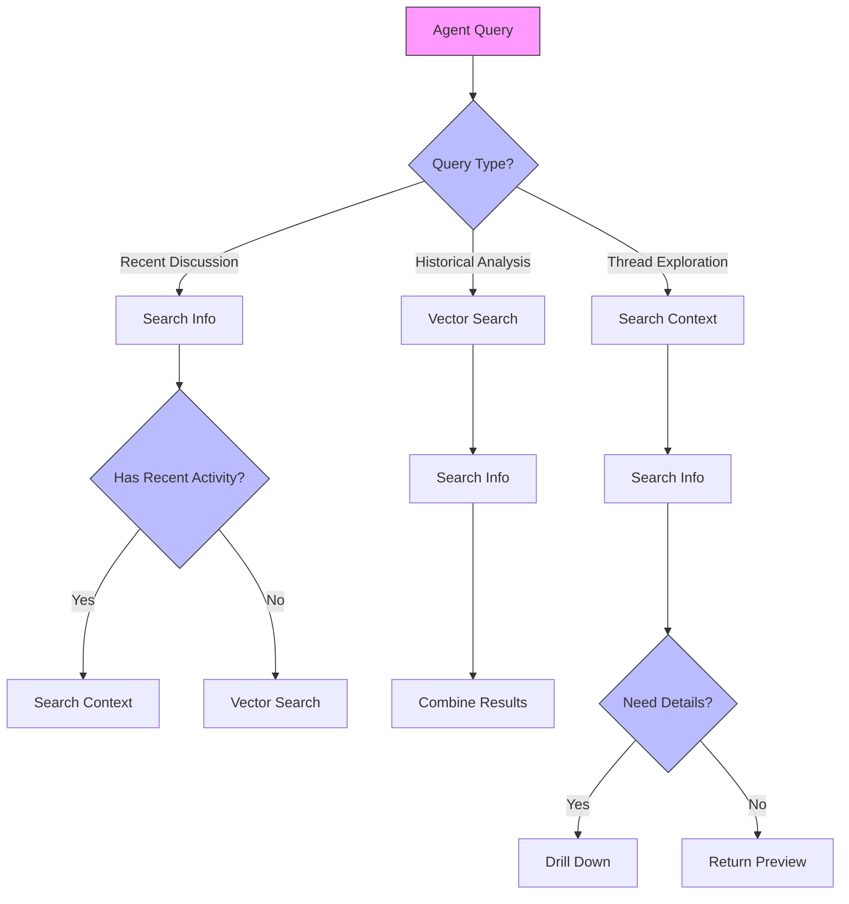

# Slack Search - Agent Usage Examples

## Decision Flow



## Overview

This guide provides examples of how agents can effectively use the Slack search tools for different scenarios. The examples demonstrate the progressive reduction approach and smart tool selection.

## Search Strategies

### 1. Recent Discussion Discovery

When looking for recent discussions:

```python
# First, use search_info to get an overview
info_results = await client.search_info(
    query="api performance issues",
    include_pinned=True  # Include pinned messages
)

# Analyze facets to understand distribution
channels = info_results["info"]["facets"]["slack"]["channels"]
dates = info_results["info"]["facets"]["slack"]["dates"]

# If recent activity found, use search_context for details
if dates[0]["day"] == today:
    context_results = await client.search_context(
        query="api performance issues",
        channel_id=channels[0]["name"]  # Focus on most active channel
    )
```

### 2. Historical Analysis

When researching past incidents:

```python
# Use vector search for historical content
vector_results = await client.vector_search(
    query="previous outages database",
    top_k=20
)

# Get metadata for the results
info_results = await client.search_info(
    query="outage database",
    include_pinned=True  # Pinned messages often contain important info
)

# Combine insights
combined_insights = {
    "historical": vector_results["results"],
    "pinned": info_results["info"]["facets"]["pinned"],
    "channels": info_results["info"]["facets"]["channels"]
}
```

### 3. Thread Exploration

When diving into specific threads:

```python
# Start with context search for the thread
thread_results = await client.search_context(
    query="deployment failure",
    thread_ts="1234567890.123456"
)

# Get metadata about the thread
thread_info = await client.search_info(
    query="deployment failure",
    include_canvases=True  # Check for related canvases
)

# Drill down into specific items
details = await client.result_reducer.drill_down(
    result_set_id=thread_info["info"]["result_set_id"],
    item_id=thread_info["info"]["page"]["items"][0]["id"]
)
```

## Progressive Discovery Patterns

### 1. Broad to Narrow

```python
async def discover_topic(query: str):
    # 1. Start broad with info search
    info = await client.search_info(query)
    
    # 2. Analyze facets
    channels = info["info"]["facets"]["slack"]["channels"]
    dates = info["info"]["facets"]["slack"]["dates"]
    
    # 3. Focus on active channels
    for channel in channels[:3]:  # Top 3 channels
        context = await client.search_context(
            query=query,
            channel_id=channel["name"]
        )
        
    # 4. Look for historical patterns
    if dates[-1]["day"] < "2024-01-01":  # Old content
        historical = await client.vector_search(query)
```

### 2. Timeline Analysis

```python
async def analyze_timeline(issue: str):
    # 1. Get recent context
    recent = await client.search_context(issue)
    
    # 2. Get historical context
    historical = await client.vector_search(
        query=issue,
        date_from="2023-01-01",
        date_to="2023-12-31"
    )
    
    # 3. Get metadata across time
    info = await client.search_info(issue)
    
    # 4. Build timeline
    timeline = {
        "recent": recent["context"],
        "historical": historical["results"],
        "distribution": info["info"]["facets"]["slack"]["dates"]
    }
```

### 3. Deep Dive

```python
async def deep_dive(topic: str):
    # 1. Get overview
    info = await client.search_info(topic)
    result_set_id = info["info"]["result_set_id"]
    
    # 2. Identify key messages
    key_messages = [
        item for item in info["info"]["page"]["items"]
        if item["reactions"] > 5  # Popular messages
    ]
    
    # 3. Drill down into each
    details = []
    for msg in key_messages:
        detail = await client.result_reducer.drill_down(
            result_set_id=result_set_id,
            item_id=msg["id"]
        )
        details.append(detail)
```

## Best Practices for Agents

1. **Start with Metadata**
   - Use search_info first
   - Analyze facets
   - Plan deeper searches

2. **Progressive Loading**
   - Start with previews
   - Use facets for navigation
   - Drill down selectively

3. **Combine Search Types**
   - Vector search for history
   - Context search for recent
   - Info search for metadata

4. **Smart Filtering**
   - Use channel facets
   - Consider date ranges
   - Look for patterns

5. **Efficient Token Usage**
   - Use preview level first
   - Request summaries when needed
   - Full content as last resort

## Common Patterns

### 1. Finding Experts

```python
async def find_experts(topic: str):
    # Get discussion distribution
    info = await client.search_info(topic)
    
    # Analyze author facets
    authors = info["info"]["facets"]["slack"]["authors"]
    
    # Get context for top authors
    expert_context = {}
    for author in authors[:3]:  # Top 3 contributors
        context = await client.search_context(
            query=topic,
            user_filter=author["id"]
        )
        expert_context[author["id"]] = context
```

### 2. Issue Investigation

```python
async def investigate_issue(issue: str):
    # Get recent context
    context = await client.search_context(issue)
    
    # Get related pinned items
    info = await client.search_info(
        query=issue,
        include_pinned=True
    )
    
    # Look for patterns
    vector = await client.vector_search(
        query=f"similar issues to {issue}",
        top_k=10
    )
```

### 3. Knowledge Discovery

```python
async def discover_knowledge(topic: str):
    # Check pinned items first
    info = await client.search_info(
        query=topic,
        include_pinned=True,
        include_canvases=True
    )
    
    # Get historical context
    vector = await client.vector_search(topic)
    
    # Get recent discussions
    context = await client.search_context(topic)
```
