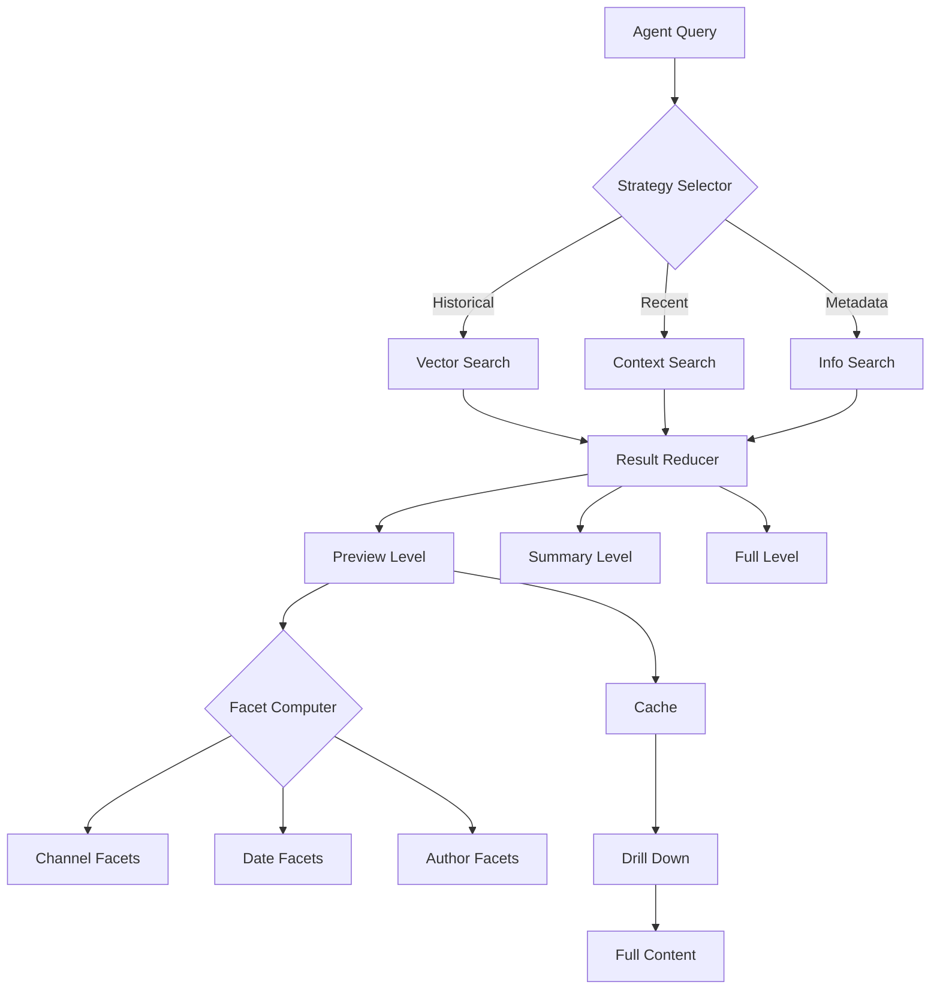
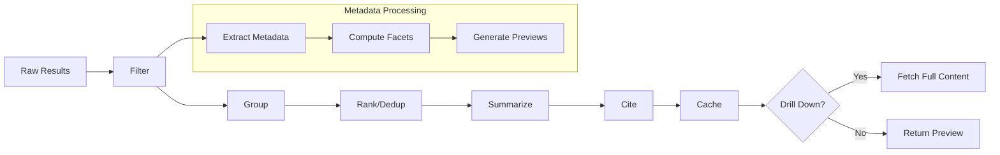
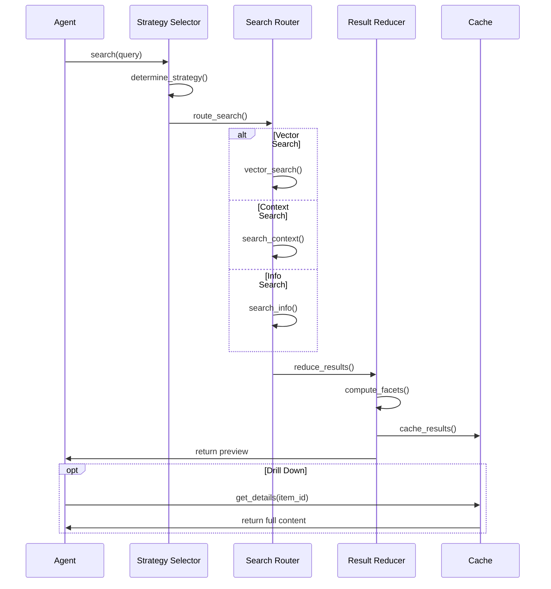

# Slack Search Tools

## Architecture

### Overall System Architecture



### Progressive Reduction Pipeline



### Typical Search Flow



## Overview

The Slack search tools provide a comprehensive set of capabilities for searching and discovering information in Slack. The system combines three complementary approaches:

1. **Vector Search** (existing) - For historical/archived content
2. **Context Search** (new) - For real-time conversation context
3. **Info Search** (new) - For metadata and high-level information

## Key Features

### Progressive Reduction Pipeline

All search results go through a progressive reduction pipeline:

```
Fetch → Filter → Group → Rank/Dedup → Summarize → Cite → (Optional) Drill-down
```

This ensures that:
- Agents get structured, token-efficient results
- Full content is only fetched when needed
- Results include rich metadata and facets

### Result Structure

Search results follow a consistent structure:

```json
{
    "result_set_id": "rs_123",
    "count": 742,
    "facets": {
        "slack": {
            "channels": [{"name": "#eng", "n": 181}],
            "dates": [{"day": "2025-08-10", "n": 96}]
        }
    },
    "page": {
        "items": [
            {
                "id": "slack:ch/eng/170921",
                "thread_id": "slack:th/170900",
                "ts": "2025-08-11T14:22:10Z",
                "author": "u123",
                "text_preview": "upgrading worker pool doubled latency...",
                "reactions": 7,
                "attachments": 1
            }
        ],
        "next_page_token": "abc"
    }
}
```

### Reduction Levels

Results can be retrieved at different detail levels:

1. **Preview** (default)
   - Metadata and short text previews
   - Faceted navigation data
   - Minimal token usage

2. **Summary**
   - Everything in preview
   - Computed summaries
   - Key statistics

3. **Full**
   - Complete message content
   - Thread context
   - All metadata

## Usage Guide

### 1. Basic Search

```python
# Vector search for historical content
results = await client.vector_search(
    query="deployment issues",
    top_k=10
)

# Context search for real-time content
results = await client.search_context(
    query="recent API changes",
    thread_ts="1234567890.123456"  # Optional
)

# Info search for metadata
results = await client.search_info(
    query="performance discussions",
    include_pinned=True,
    include_canvases=True
)
```

### 2. Progressive Loading

```python
# 1. Get initial results
results = await client.search_info(query="api performance")
result_set_id = results["info"]["result_set_id"]

# 2. Drill down into specific item
details = await client.result_reducer.drill_down(
    result_set_id=result_set_id,
    item_id="slack:ch/eng/170921"
)
```

### 3. Working with Facets

Facets provide aggregated views of the results:

```python
# Channel distribution
channels = results["info"]["facets"]["slack"]["channels"]
# [{"name": "#eng", "n": 181}, ...]

# Date distribution
dates = results["info"]["facets"]["slack"]["dates"]
# [{"day": "2025-08-10", "n": 96}, ...]

# Author distribution
authors = results["info"]["facets"]["slack"]["authors"]
# [{"id": "U123", "n": 45}, ...]
```

## Implementation Details

### Result Reducer

The `SlackResultReducer` class handles the progressive reduction pipeline:

```python
reducer = SlackResultReducer()

# Get preview results
preview = await reducer.reduce_results(
    results,
    reduction_level="preview"
)

# Get full content
full = await reducer.reduce_results(
    results,
    reduction_level="full"
)
```

### Caching

Results are cached by result_set_id to enable:
- Efficient drill-down operations
- Progressive loading of details
- Facet computation

## Best Practices

1. **Start with Info Search**
   - Get high-level overview
   - Use facets for navigation
   - Identify relevant items

2. **Use Context Search for Conversations**
   - When exploring specific threads
   - For real-time context
   - When thread_ts is known

3. **Use Vector Search for Historical Analysis**
   - For older content
   - Pattern finding
   - Comprehensive search

4. **Progressive Loading**
   - Start with preview level
   - Use facets for filtering
   - Drill down only when needed

## Rate Limiting Considerations

Different search types have different rate limits:

- Vector Search: Based on Pinecone limits
- Context Search: Higher limits (60/minute)
- Info Search: Higher limits (60/minute)

## Error Handling

All search methods return a consistent error structure:

```json
{
    "success": false,
    "message": "Error description"
}
```

## Future Enhancements

1. **Advanced Faceting**
   - Custom facet computation
   - Dynamic facet selection
   - Hierarchical facets

2. **Improved Summarization**
   - LLM-based summaries
   - Thread summarization
   - Topic extraction

3. **Enhanced Caching**
   - Redis integration
   - TTL management
   - Cache invalidation
