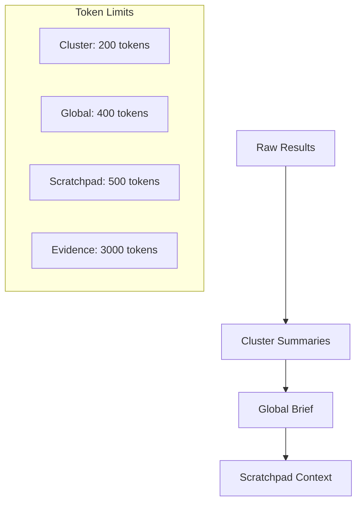

# Token Policy for Research Tools

## Overview

This document outlines the token policies for research tools to ensure efficient use of context windows and maintain performance. The policies are designed to support progressive reduction while staying well under typical model token limits.



## Token Limits

### 1. Cluster Summaries
- **Per Cluster**: ≤200 tokens
- **Max Clusters**: 10 in context
- **Total Limit**: ≤2,000 tokens
- **Purpose**: Maintain concise, focused summaries of related information

### 2. Global Brief
- **Limit**: ≤300-400 tokens
- **Purpose**: Provide high-level synthesis of findings
- **Content**: Key points, patterns, and relationships

### 3. Scratchpad Context
- **Limit**: Rolling ≤500 tokens
- **Purpose**: Maintain working memory for agent
- **Behavior**: Oldest content rolls off as new content added

### 4. Evidence Budget
- **Total per Step**: ~3,000 tokens
- **Purpose**: Raw evidence for verification and drill-down
- **Note**: Well under typical model context limits

## Implementation Guidelines

### 1. Progressive Reduction
```python
def reduce_cluster(messages: List[str]) -> str:
    """Reduce cluster to summary under 200 tokens"""
    summary = summarize(messages)
    while count_tokens(summary) > 200:
        summary = reduce_further(summary)
    return summary

def create_global_brief(clusters: List[str]) -> str:
    """Create global brief under 400 tokens"""
    brief = synthesize(clusters)
    while count_tokens(brief) > 400:
        brief = reduce_further(brief)
    return brief
```

### 2. Scratchpad Management
```python
class Scratchpad:
    def add_content(self, content: str):
        """Add content while maintaining token limit"""
        while count_tokens(self.content + content) > 500:
            self.remove_oldest()
        self.content += content
```

### 3. Evidence Handling
```python
def fetch_evidence(ids: List[str]) -> Dict[str, str]:
    """Fetch evidence while respecting token budget"""
    evidence = {}
    total_tokens = 0
    
    for id in ids:
        content = fetch(id)
        tokens = count_tokens(content)
        
        if total_tokens + tokens > 3000:
            break
            
        evidence[id] = content
        total_tokens += tokens
        
    return evidence
```

## Best Practices

1. **Summary Generation**
   - Focus on key information
   - Use concise language
   - Maintain citations/references

2. **Context Management**
   - Prioritize recent/relevant content
   - Remove redundant information
   - Keep evidence links intact

3. **Evidence Handling**
   - Fetch on demand
   - Prioritize most relevant evidence
   - Cache frequently accessed items

## Monitoring and Adjustment

1. **Token Usage Tracking**
```python
class TokenTracker:
    def __init__(self):
        self.cluster_tokens = 0
        self.brief_tokens = 0
        self.scratchpad_tokens = 0
        self.evidence_tokens = 0
        
    def log_usage(self, category: str, tokens: int):
        """Log token usage by category"""
        if category == "cluster":
            self.cluster_tokens += tokens
        # ... etc
```

2. **Alerts and Warnings**
```python
def check_token_limits(tracker: TokenTracker):
    """Check for token limit violations"""
    if tracker.cluster_tokens > 2000:
        warn("Cluster token limit exceeded")
    if tracker.brief_tokens > 400:
        warn("Brief token limit exceeded")
    # ... etc
```

## Future Considerations

1. **Dynamic Adjustment**
   - Adjust limits based on model
   - Scale with context size
   - Optimize for specific use cases

2. **Advanced Reduction**
   - ML-based summarization
   - Importance scoring
   - Context-aware pruning

3. **Integration Points**
   - Multi-source evidence
   - Cross-reference tracking
   - Chain-of-thought preservation
